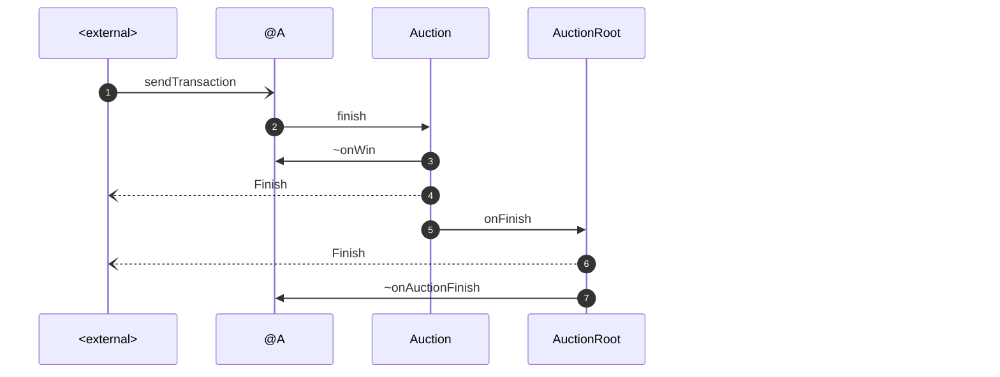

# Never Auction

Project Github: https://github.com/tonred/NeverAuction

DevNet Auction Root: `0:3f2d260ccef3ba4bc4581da87918ca76162ccc20e286082d9ebb384fdfc4e780`

DevNet Never Elector: `0:747b9c2481513959f4a7f778b42724ac5e5f81953d73c77d0e083a5542f13340`

DevNet Never Token Root: `0:bc661b83bb88f76b9e17a09e053a4f13a8bc5c05beb3c6ed77d31cf7d02250e3`

TG: @Abionics, @get_username

## Key features:
* Really blind Vickrey auction
* DeAuction for group bid
* No mappings, infinity amount of bids and DeParticipants
* Well tested, 30 `ts4` tests
* A lot of custom configurations
* Browser viewer for deployed auctions

## Requirements:
* [locklift](https://www.npmjs.com/package/locklift) `1.5.3`
* [everdev](https://github.com/tonlabs/everdev) with compiler=`0.59.4`, linker=`0.15.24`
* python `>=3.8`
* nodejs

## Setup environment
1) Setup `locklift.config.js` and `.env` for templates
2) Create and activate python venv
3) Install npm `npm install`
4) Run setup `npm run setup`
5) Read steps below

## Build
```shell
npm run build
```
// todo

Read technical description below

## Test
```shell
npm run test
```

There are 30 different test cases. They cover both Auction and DeAuction usage.
Set env variable `TS4_VERBOSE=true` in order to see flow of method calls.
In case of trouble with `npm`, just go to `test/ts4` folder and call `run_tests.sh` manually

## Deployment
```shell
npm run 1-deploy-account.js
npm run 2-deploy-never-root.js
npm run 3-deploy-auction-root.js
npm run 4-deploy-never-elector.js  # (optionally)
```
Don't forget to set up network url in `locklift.config.js` before deployment.
In step **#3** you can set Auction Root owner (elector) to your wallet address
in order to create and test auctions on your own way

## Technical description

### Auction
Source code: [Auction.sol](contracts/Auction.sol)

Each auction has 5 phases (see [Phase.sol](contracts/structures/Phase.sol)):
1) `Open` - in this phase anyone can make and remove his blind bid. To do this,
user must generate random salt, locally encode your bid via `calcBidHash` method and 
then send this hash to `makeBid`. This bid hash contains from price for 1 token,
amount to buy, sender address and random salt. User also must send a deposit value
in order to prevent spamming with bids without revealing them. User also can remove their bid
and get deposit back in this phase via method `removeBid`
2) `DeBid` - this phase is used for DeAuction bidding, we will back to it bellow.
Only DeAuctions can bid in this phase
3) `Confirm` - users must confirm their bid by sending price, amount and salt to
`confirmBid` method. If all values are correct, then bid is counted and user gets back
his deposit (minus some small fee for gas)
4) `Finish` - this phase means than all bids are done (or time passed) and auction can be finished.
To finish auction, anyone can call `finish` method in this phase.
5) `Done` - used after finishing auction, means that it is completely ended

As mentioned above, some bid `deposit` used in order to prevent spamming with bids without
revealing them. This deposit will be instantly returned after bid confirmation.
Each bid is a separate contract [Bid.sol](contracts/Bid.sol).

// todo args contstructor

<details>
<summary>Click here to see diagrams</summary>

**Make bid:**


**Remove bid:**
```mermaid
```

**Confirm bid:**
```mermaid
sequenceDiagram
    autonumber

    external -) 0fa94171cb0565789224814561cc558e59315971ee9d03085de3dcb5f8b94d95e: sendTransaction
    0fa94171cb0565789224814561cc558e59315971ee9d03085de3dcb5f8b94d95e ->> 040e454e24d436557a1ab10ffb7305be07ad067eab25f0fbda58a500c6abd3c8e: confirmBid
    040e454e24d436557a1ab10ffb7305be07ad067eab25f0fbda58a500c6abd3c8e ->> 0f8826d6816f436d77aad381979dafdf1022e3d8c04f6c1d35cda28023f4ab2a7: ~confirm
    0f8826d6816f436d77aad381979dafdf1022e3d8c04f6c1d35cda28023f4ab2a7 ->> 040e454e24d436557a1ab10ffb7305be07ad067eab25f0fbda58a500c6abd3c8e: onConfirmBid
    040e454e24d436557a1ab10ffb7305be07ad067eab25f0fbda58a500c6abd3c8e ->> 0fa94171cb0565789224814561cc558e59315971ee9d03085de3dcb5f8b94d95e: ~onConfirmBid
    040e454e24d436557a1ab10ffb7305be07ad067eab25f0fbda58a500c6abd3c8e --) external: ConfirmBid

    participant external as #60;external#62;
    participant 0fa94171cb0565789224814561cc558e59315971ee9d03085de3dcb5f8b94d95e as @A
    link 0fa94171cb0565789224814561cc558e59315971ee9d03085de3dcb5f8b94d95e: 0:fa94171cb0565789224814561cc558e59315971ee9d03085de3dcb5f8b94d95e @
    link 0fa94171cb0565789224814561cc558e59315971ee9d03085de3dcb5f8b94d95e: delta: 0.985015732 @
    link 0fa94171cb0565789224814561cc558e59315971ee9d03085de3dcb5f8b94d95e: #64;ever.live @ https://net.ever.live/accounts/accountDetails?id=0:fa94171cb0565789224814561cc558e59315971ee9d03085de3dcb5f8b94d95e
    link 0fa94171cb0565789224814561cc558e59315971ee9d03085de3dcb5f8b94d95e: #64;tonscan.io @ https://dev.tonscan.io/accounts/0:fa94171cb0565789224814561cc558e59315971ee9d03085de3dcb5f8b94d95e
    participant 040e454e24d436557a1ab10ffb7305be07ad067eab25f0fbda58a500c6abd3c8e as Auction
    link 040e454e24d436557a1ab10ffb7305be07ad067eab25f0fbda58a500c6abd3c8e: 0:40e454e24d436557a1ab10ffb7305be07ad067eab25f0fbda58a500c6abd3c8e @
    link 040e454e24d436557a1ab10ffb7305be07ad067eab25f0fbda58a500c6abd3c8e: delta: -0.558053367 @
    link 040e454e24d436557a1ab10ffb7305be07ad067eab25f0fbda58a500c6abd3c8e: #64;ever.live @ https://net.ever.live/accounts/accountDetails?id=0:40e454e24d436557a1ab10ffb7305be07ad067eab25f0fbda58a500c6abd3c8e
    link 040e454e24d436557a1ab10ffb7305be07ad067eab25f0fbda58a500c6abd3c8e: #64;tonscan.io @ https://dev.tonscan.io/accounts/0:40e454e24d436557a1ab10ffb7305be07ad067eab25f0fbda58a500c6abd3c8e
    participant 0f8826d6816f436d77aad381979dafdf1022e3d8c04f6c1d35cda28023f4ab2a7 as Bid
    link 0f8826d6816f436d77aad381979dafdf1022e3d8c04f6c1d35cda28023f4ab2a7: 0:f8826d6816f436d77aad381979dafdf1022e3d8c04f6c1d35cda28023f4ab2a7 @
    link 0f8826d6816f436d77aad381979dafdf1022e3d8c04f6c1d35cda28023f4ab2a7: delta: -0.494428000 @
    link 0f8826d6816f436d77aad381979dafdf1022e3d8c04f6c1d35cda28023f4ab2a7: #64;ever.live @ https://net.ever.live/accounts/accountDetails?id=0:f8826d6816f436d77aad381979dafdf1022e3d8c04f6c1d35cda28023f4ab2a7
    link 0f8826d6816f436d77aad381979dafdf1022e3d8c04f6c1d35cda28023f4ab2a7: #64;tonscan.io @ https://dev.tonscan.io/accounts/0:f8826d6816f436d77aad381979dafdf1022e3d8c04f6c1d35cda28023f4ab2a7
```

**Finish auction:**


```solidity
function makeBid(uint256 hash) external;
function removeBid(uint256 hash) external view;
function confirmBid(uint128 price, uint128 amount, uint256 salt) external view;
function calcBidHash(uint128 price, uint128 amount, address owner, uint256 salt) external view returns (uint256 hash);
function finish() external;
```

</details>

### DeAuction


{
  "Account": {
    "address": "0:584b18626761c3a584101de8cb604c4dcfab3e8ffdc3c6893ba5cd55527e5078",
    "name": "Wallet"
  },
  "NeverRoot": {
    "address": "0:bc661b83bb88f76b9e17a09e053a4f13a8bc5c05beb3c6ed77d31cf7d02250e3",
    "name": "TestNeverRoot"
  },
  "AuctionRoot": {
    "address": "0:3f2d260ccef3ba4bc4581da87918ca76162ccc20e286082d9ebb384fdfc4e780",
    "name": "AuctionRoot"
  },
  "NeverElector": {
    "address": "0:747b9c2481513959f4a7f778b42724ac5e5f81953d73c77d0e083a5542f13340",
    "name": "NeverElectorAuction"
  }
}

ECC
INTERAFECECCE
CONSTANTS GAS COMFIGS