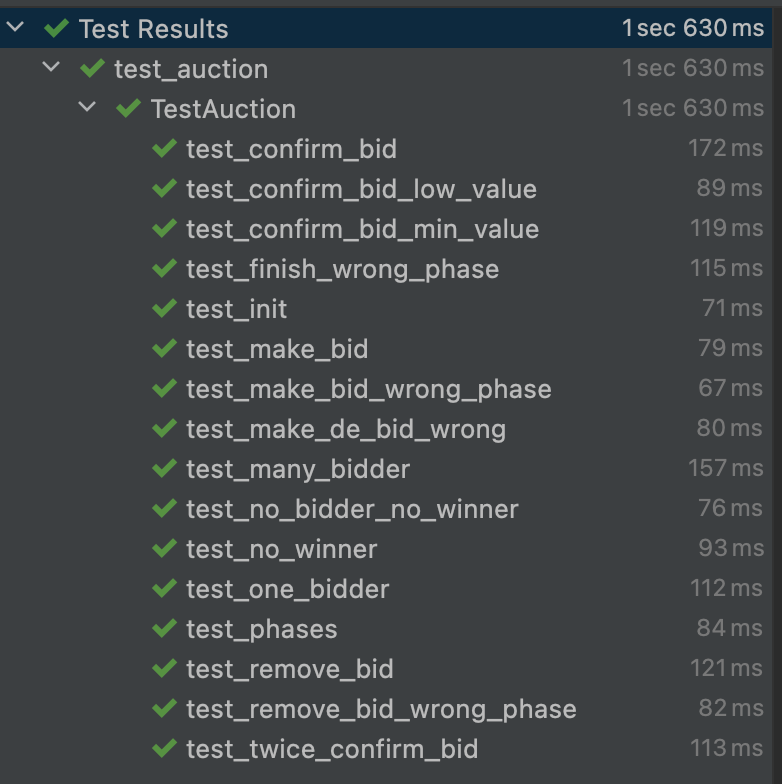

# Never Auction

Project Github: https://github.com/tonred/NeverAuction

DevNet Auction Root: `0:d37297b1eba504c3ec3c9d3c4fab7c3d4eb5152e39e380d727705c20fa8a2ff3`

TG: @Abionics, @get_username

## Key features:
* Really blind Vickrey auction
* DeAuction for group bid with interesting concept
* No mappings, infinity amount of bids and DeParticipants
* Well tested, 30 `ts4` tests
* A lot of custom configurations
* Browser viewer for deployed auctions

## Requirements:
* [locklift](https://www.npmjs.com/package/locklift) `1.5.3`
* [everdev](https://github.com/tonlabs/everdev) with compiler=`0.59.4`, linker=`0.15.24`
* python `>=3.8`
* nodejs

## Setup environment
1) Setup `locklift.config.js` and `.env` for templates
2) Create and activate python venv
3) Install npm `npm install`
4) Run setup `npm run setup`
5) Read steps below

## Build
```shell
npm run build
```
// todo

Read technical description below

## Test
```shell
npm run test
```

There are 30 different test cases. They cover both Auction and DeAuction usage.
Set env variable `TS4_VERBOSE=true` in order to see flow of method calls.
In case of trouble with `npm`, just go to `test/ts4` folder and call `run_tests.sh` manually




## Deployment
```shell
npm run 1-deploy-account.js
npm run 2-deploy-never-root.js
npm run 3-deploy-auction-root.js
npm run 4-deploy-never-elector.js  # (optionally)
```
Don't forget to set up network url in `locklift.config.js` before deployment.
In step **#3** you can set Auction Root owner (elector) to your wallet address
in order to create and test auctions on your own way

## Technical description

### Auction
Source code: [Auction.sol](contracts/Auction.sol)

Auction is created by Auction Root. It has some configurable values:
fee, deposit, time of each phase and bid code. These values are set up
can in Auction Root and can be changed  by Elector

Each auction has 5 phases (see [Phase.sol](contracts/structures/Phase.sol)):
1) `Open` - in this phase anyone can make and remove his blind bid. To do this,
user must generate random salt, locally encode your bid via `calcBidHash` method and 
then send this hash to `makeBid`. This bid hash contains from price for 1 token,
amount to buy, sender address and random salt. User also must send a deposit value
in order to prevent spamming with bids without revealing them. User also can remove their bid
and get deposit back in this phase via method `removeBid`
2) `DeBid` - this phase is used for DeAuction bidding, we will back to it bellow.
Only DeAuctions can bid in this phase
3) `Confirm` - users must confirm their bid by sending price, amount and salt to
`confirmBid` method. If all values are correct, then bid is counted and user gets back
his deposit (minus some small fee for gas)
4) `Finish` - this phase means than all bids are done (or time passed) and auction can be finished.
To finish auction, anyone can call `finish` method in this phase.
5) `Done` - used after finishing auction, means that it is completely ended

As mentioned above, some bid `deposit` used in order to prevent spamming with bids without
revealing them. This deposit will be instantly returned after bid confirmation.
Each bid is a separate contract [Bid.sol](contracts/Bid.sol).

**Make bid:**


**Remove bid:**


**Confirm bid:**


**Finish auction:**


<details>
<summary>Click here to see interfaces for diagrams above</summary>

```solidity
function makeBid(uint256 hash) external;
function removeBid(uint256 hash) external view;
function confirmBid(uint128 price, uint128 amount, uint256 salt) external view;
function calcBidHash(uint128 price, uint128 amount, address owner, uint256 salt) external view returns (uint256 hash);
function finish() external;
```

</details>

### DeParticipant
Source code: [DeParticipant.sol](contracts/DeParticipant.sol)

This is a user data for creation and interation with DeAuction.
It is deployed once for each wallet. At has locker in order to prevent
double spending and double bidding. See diagrams in DeAuction section
because DeParticipant are closely related with DeAuction

<details>
<summary>Click here to see main function for DeParticipant</summary>

```solidity
function createDeAuction(string description, PriceRange prices, uint128 deviation, uint128 fee, uint128 value) external view;
function stake(address deAuction, uint128 value, optional(uint256) priceHash) external view;
function removeStake(address deAuction, uint128 value) external view;
function confirmPrice(address deAuction, uint128 price, uint256 salt) external;
function claim(address deAuction) external view;
function calcPriceHash(uint128 price, uint256 salt) external view returns (uint256 hash);
```

</details>

### DeAuction
Source code: [DeAuction.sol](contracts/DeAuction.sol)

Both DeParticipant and DeAuction are created by Auction Root.
Anyone can create DeAuction from DeParticipant if there is active Auction.
Let's call the deployer of DeAuction as **Aggregator** (see [whitepaper](https://firebasestorage.googleapis.com/v0/b/ton-labs.appspot.com/o/documents%2Fapplication%2Fpdf%2F4rdykjz6rxbkk4gmv6k-NOT%20a%20TON%20Binary%20System.pdf?alt=media&token=8fca4969-e2cc-477d-bc80-1456e8107f1b)).
Aggregator can set up some parameters of DeAuction:
1) Price range - **first** interesting concept of DeAuctions. It has predefined price range with
min and max price that it DeParticipant can suggest (read below about consensus) and Aggregator 
must make bid only from this price range
2) Deviation - **second** interesting concept of DeAuctions. It is a percent on which
DeAuction's final price bid can be different from consensus price (read below about consensus)
3) Description - just a text that describe this DeAuction, it plans etc
4) Aggregator fee - just a fee of aggregator from distributed Never value
5) Aggregator stake - initial aggregator value, aggregator can increase it, but not decrease

#### DeAuction consensus
This is a third interesting concept, each DeAuction has a local Vickrey voting. Every DeParticipant
can (but not must) provide a hash of desire price. As mentioned above, this price must be in
DeAuction price range. This local voting starts immediately after DeAuction created, and confirm
phase of this voting starts in one time with `DE_BID` main phase. This means that common users
won't be able to use revealed price in their bids.  Main `DE_BID` phase splits into 2 DeAuction phases. In first one DeParticipants must reveal their
prices (if exist), in second phase Aggregator must make a bid

Consensus price are calculated as average between DeParticipant prices, where each price has
weight of its owner's stake. To be exact, the formula is:


If no one price was confirm, then consensus price is average in possible price range. If someone
doesn't provide a desire price, or forget to confirm, then his price is not included is
average calculation. But his stake is participating and such DeParticipant will get his
reward in case of winning

#### DeAuction phases
DeAuctions can have such phases (let call them DePhase, see [DePhase.sol](contracts/structures/DePhase.sol)):
1) `INITIALIZING` - used when contract is not inited
2) `SUB_OPEN` - it this phase everyone can join and stake. Also, everyone, except the Aggregator,
can remove his stake, partially or fully. All these actions are done via DeParticipant methods
`stake` and `removeStake` (price hash can be calculated via `calcPriceHash` method)
3) `SUB_CONFIRM` - in this phase users that provide price in previous step can confirm it via
`confirmPrice` method in DeParticipant
4) `SUB_FINISH` - this phase means that time for confirming price is passed. Someone should call
`finishSubVoting` in order to calculate consensus price, stop DeAuction if not enough fund and
continue to next phase
5) `WAITING_BID` - this phase means that Aggregator must make a bid. He should locally call
`allowedPrice` to get allowed price range, `calcBidHash` to calculate bid hash and finally
`makeBid` to make bid in main Auction. Don't forget that allowed price is always in
DeAuction price range, and does not differ from the consensus value by more than
`deviation` percents (in other case `calcBidHash` will throw an exception)
6) `BID_MADE` - means that Aggregator made bid, but Aggregator should
track Auction phase in order to don't forget to confirm bid
7) `BID_CONFIRMED` - means that Aggregator confirmed bid (which is so obvious)
8) `WIN` - used when DeAuction won, but Never tokens are not transferred yet
9) `DISTRIBUTION`  - means that never tokens are transferred, everyone can claim them
via `claim` in DeParticipant
10) `LOSE` - means that DeAuction lose (or not enough funds), everyone can claim his stake back
via `claim` in DeParticipant
11) `SLASHED` - used when Aggregator was slashed. Everyone except the Aggregator can get his stake
back via `claim` in DeParticipant, see slashing details below

#### DeAuction slashing
Everyone can locally check if Aggregator must be slashed via `checkAggregator` method.
Slashing is used if Aggregator forget to make bid in until end of `DE_BID` phase, or forget
to confirm bid until end of `CONFIRM` phase. Is this case, anyone can call `slash` method
directly in DeAuction. After slashing, Aggregator lose his stake, and it is distributed
among all DeParticipant proportionately to their stakes. They can claim their stake and
slash reward via `claim` in DeParticipant

### DeParticipant and DeAuction diagrams

**Create DeAuction:**


**DeAuction stake (same for remove stake):**


**Finish sub voting (DeAuction consensus):**


**DeAuction makes bid (same for confirm):**


**DeAuction wins:**


<details>
<summary>Click here to see main function for DeAuction</summary>

```solidity
function finishSubVoting() external;
function allowedPrice() external view returns (PriceRange allowed);
function calcBidHash(uint128 price, uint256 salt) external view returns (uint256 hash);
function makeBid(uint256 hash) external view;
function confirmBid(uint128 price, uint256 salt) external;
function onWin(uint128 price, uint128 amount) external override;
function pingAuctionFinish() external view;
function checkAggregator() external view returns (bool isFair);
function slash() external;
```

</details>

## Viewer
Viewer listen for events and display all info about current auction


## Constants

All contact system is very configurable. There are several configuration places:
1) contracts/utils/Constants.sol (MIN_LOT_SIZE) - contact constants
2) contracts/utils/Gas.sol - contact gas (already optimized)
3) scripts/3-deploy-auction-root.js - deploy default params for Auctions and DeActions,
optimal value is specified in comments 
4) scripts/5-deploy-auction-root.js - deploy params for DevNet tests

## Other features
DeAuction supports both TIP3.1 standard (broxus realization) and Extra Currency Collection (ECC).
There is common [DeAuction](contracts/DeAuction.sol) abstract contract, and specified
realization [DeAuctionTIP3](contracts/DeAuctionTIP3.sol) and [DeAuctionECC](contracts/DeAuctionECC.sol)

All contracts have separate list of interfaces, you can find they
in `contracts/interfaces/internal` folder

## Demo
**Important! All demos must be started only from project root folder (not from demo folder)!**

There are several demos for quick verifying of work:
1) `./demo/1-init.sh` - initializing project
(do it after steps that describes in [setup environment](#Setup-environment)!)
2) `./demo/2-build.sh.sh` - compile source files
3) `./demo/3-test.sh` - test all
4) `./demo/4-deploy.sh` - deploy to network passed in `locklift.config.js`
5) `./demo/5-integration.sh` - call only after 4th step, demo of integration with
[solution in Phase 1](https://firebasestorage.googleapis.com/v0/b/ton-labs.appspot.com/o/documents%2Fapplication%2Fpdf%2Fjz5i5hcndnktkekjat-NOT%20Pruvendo%20Implementation%20draft%203.pdf?alt=media&token=015ee545-fe73-432c-a525-9a4e672128ba)

Additional script demo for manual testing: `./demo/demo-devnet.sh`
(it deploys in network that specified in `locklift.config.js`)

Or just use `build/TestAuctionRoot.abi.json` with Auction Root in DevNet
at address `0:d37297b1eba504c3ec3c9d3c4fab7c3d4eb5152e39e380d727705c20fa8a2ff3`
